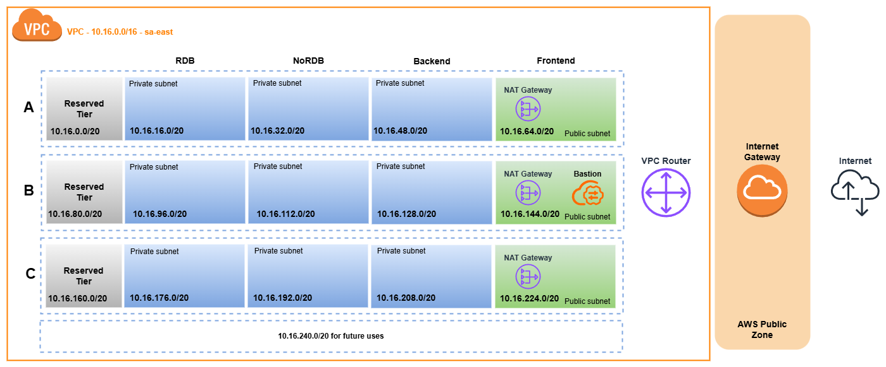

# Exercise 1 - Network diagram
To generate a network diagram to communicate the different components of the application, a VPC is designed in AWS.
First of all, the IP range to be used in the VPC is defined, since it is not easy to change it once it is implemented. IP ranges that are in use by other services, that are in common use by other providers, among other things, should be avoided. The size of the VPC is influenced by the number of services it will host, in this case they are:
- Frontend: provided in the statement.
- Backend: provided in the statement.
- Relational database: provided in the statement.
- Non-relational database: provided in the statement.
- Future use service: added to reserve IP ranges for services that need to be added in the future.

IP ranges have to be separated by tiers to distinguish each service of the application, therefore, the Frontend tier, the Backend tier, the DBR tier, the DBNoR tier and a reserved tier for future uses are defined. It is decided to use a /16 network for the VPC to have the possibility to create 16 subnets with 4091 hosts per subnet. The VPC network will be 10.16.0.0/16 and the distribution of subnets in the São Paulo region is shown in the following image:

In order to provide high availability and resiliency, 3 AZs are to be used within the São Paulo region (they can be 3 AZs from another region). By using 3 AZs, each service will have its own subnet in each AZ making use of 15 subnets. That is, 3 frontend subnets, 3 backend subnets, 3 relational database subnets, 3 non-relational database subnets and 3 subnets for future services. An additional subnet is left to host future services (in region and AZ to be defined) if desired, it is another type of reservation. Once created, IPv6 address assignment must be enabled in each of them.

Blue subnets refer to private subnets within the VPC, while green subnets mean subnets configured as public within the VPC. The gray subnets would not be in use initially so they would be private. The subnets related to the frontend are configured as public since users who want to access the application's website must be able to access such services within the VPC's public subnet.

An Internet Gateway must be defined in the San Pablo region and linked to the VPC created, since this is what allows the services within a VPC that have a public IPv4 or IPv6 assigned to them to be reached from the Internet and connect to the AWS public zone. In addition, the same routing table must be configured for the 3 frontend subnets where the default routes for IPv4 and IPv6 will be the Internet Gateway. What is done is to send the traffic that is not for any of the services within the VPC to the Internet Gateway.

Bastion Host is defined in the public subnets, which will be used to manage incoming connections and after they are connected to these they are newly enabled to have access to internal VPC resources.

In terms of security to be defined in this architecture, Security Groups (SG) and Network Access Control Lists (NACL) are used. Using SG, rules can be defined to allow incoming traffic to resources from certain IP ranges, such as external microservices consumed by the backend. To explicitly deny traffic, NACLs are used where rules are defined based on certain values (destination IP, destination port and protocol), and if any of these rules are met, traffic can be accepted or denied. It is important to emphasize that NACL works in a stateless way so two rules must be defined for each traffic to be defined. One for the incoming request and one for the response to that request. While SG works in a stateful way.

A NAT Gateway is defined on the public subnets, and then on the private subnets a routing table can be set up with a record for those destination IPs going outside the VPC to be routed to the NAT Gateway located on the public subnet. For example, the two external microservices consumed by the backend.
To support variable loads, automatic scaling policies should be configured in the system to increase or decrease the number of instances according to metrics such as CPU usage, memory or number of queued requests.